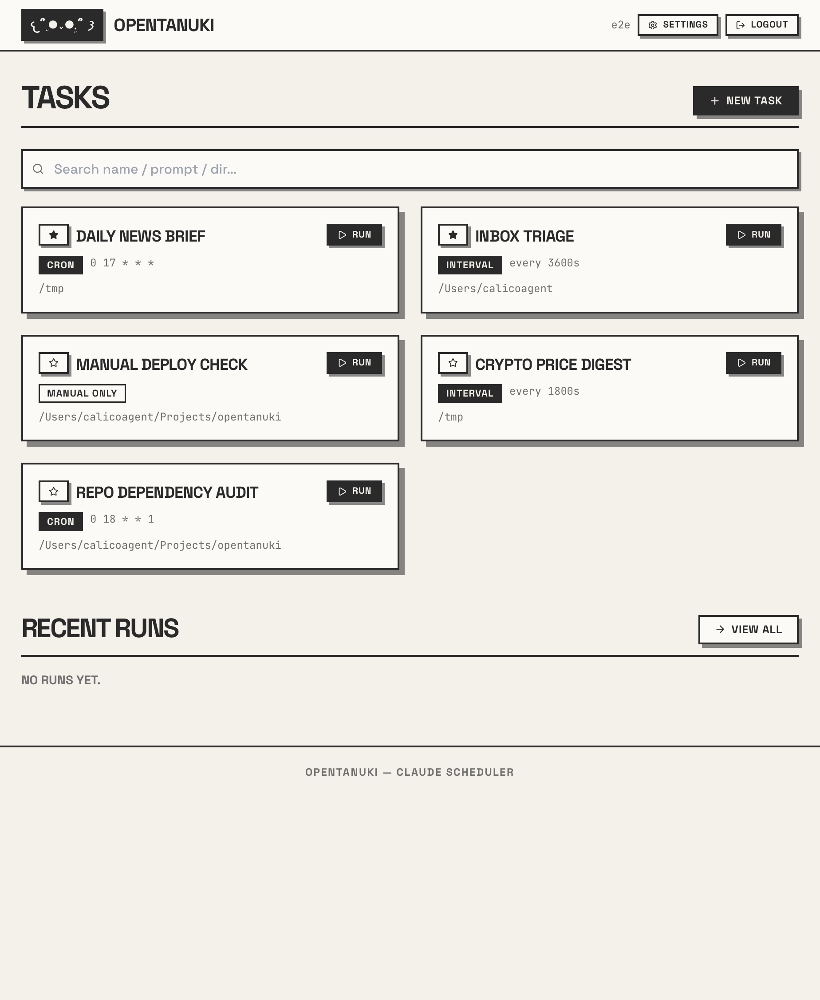
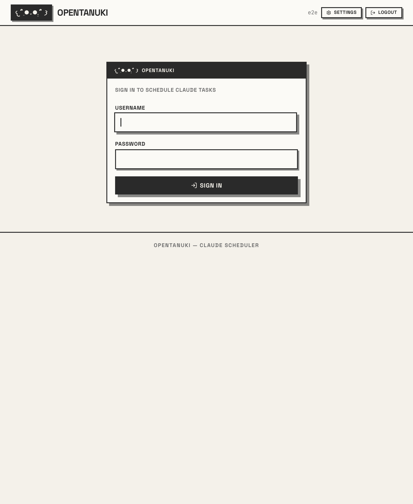
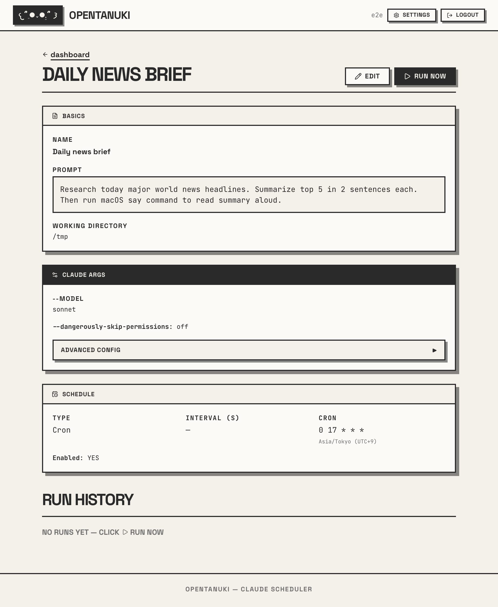
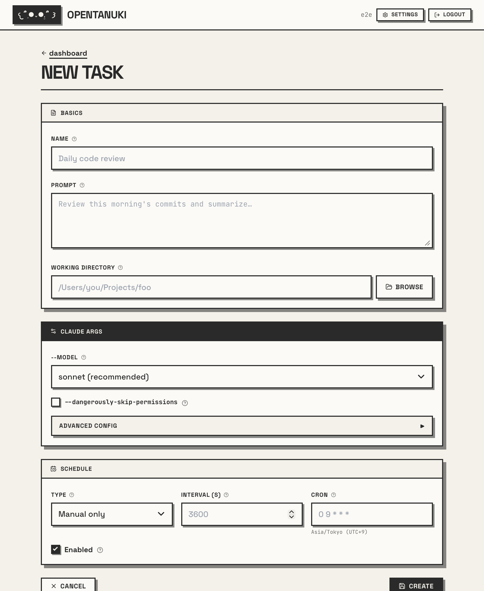

# OpenTanuki

Self-hosted scheduler for `claude -p`. Run Claude Code on cron, interval, or manual triggers. Live-stream output via SSE. Per-user task isolation. SQLite + Redis. Neobrutalism UI.



## Stack

- Django 6 + sqlite + htmx + Tailwind (CDN) + Space Grotesk
- Celery + Redis (worker + beat)
- Granian (ASGI) + WhiteNoise
- pydantic-settings
- django-ninja for JSON API

## Quick start

```bash
cp .env.example .env       # set DJANGO_SECRET_KEY
make install               # uv sync
make redis                 # docker compose up -d redis
make migrate
make user                  # createsuperuser
```

Run in 3 terminals:

```bash
make web                   # granian on PORT (default 8888)
make worker                # celery worker
make beat                  # celery beat
```

Open http://127.0.0.1:8888

## Sample use cases

| Schedule | Prompt | Why |
|---|---|---|
| `0 8 * * *` (cron) | "Research today's world news. Summarize top 5 in 2 sentences each. `say` summary aloud." | Morning briefing read aloud while making coffee |
| `*/30 * * * *` (interval 1800s) | "Fetch BTC + ETH + SOL spot price. Compare to 24h ago. `say` deltas." | Background market pulse |
| `0 9 * * 1` (cron) | "`uv pip list --outdated`. Pick top 3 with breaking-change risk. Write to `~/Desktop/dep-audit.md`." | Monday dependency review |
| every 1h | "Read latest 20 emails from `~/Mail`. Group by sender, flag urgent. Output ranked action list." | Inbox triage loop |
| manual | "Check git status of project. Print uncommitted file count + diverged commit count vs origin." | Pre-deploy gate |

Each task runs `claude -p <prompt>` in its own working directory with full CLI flag coverage (`--model`, `--permission-mode`, `--allowedTools`, `--add-dir`, `--max-budget-usd`, etc).

## Screens

### Login


### Dashboard
Favorites pinned, search across name/prompt/dir, recent runs table polls live.


### Task detail
Run history table updates every 2s. Run-now button disabled while task active.



### New / edit task
Full claude `-p` arg surface. Cron entered in local timezone, stored UTC.



## Layout

```
app/                       # Django project
  app_settings.py          # pydantic-settings groups
  settings.py              # reads APP_SETTINGS
scheduler/
  models/                  # one model per file
    task.py setting.py run.py _base.py
  routes/                  # ninja routes, one verb per file
    dashboard/get_index.py
    tasks/get_runs.py
    tasks/post_trigger.py
  views/                   # one Django view per file
  templates/scheduler/
  tests.py                 # 94 tests, 88% coverage
```

## Auth

Per-user isolation enforced at every query: `task__user=request.user`. Cross-user reads return 404. Tasks fan out into Celery beat as user-tagged `PeriodicTask` rows; runs inherit the task's user via FK.

## Settings + secrets

`Setting` model stores OAuth token / API key in sqlite for the worker to inject as env vars before `claude -p`. Plain text — protect host. Set via `/settings/` UI.

## Test

```bash
make test                  # 94 tests
```

## License

MIT.
